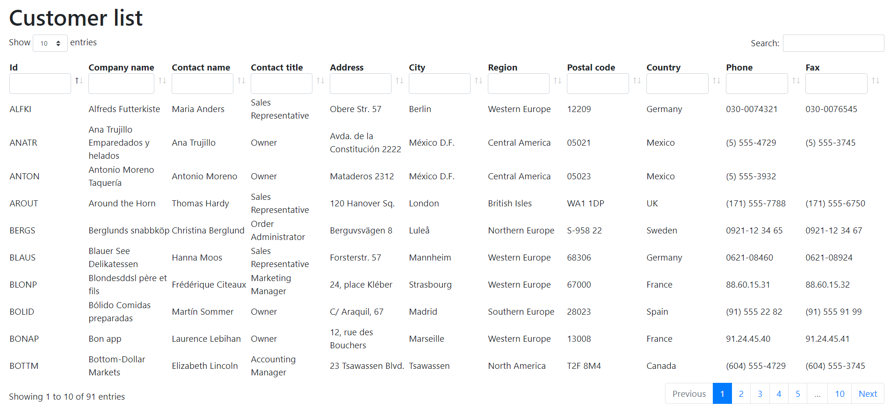

# Demo DataTables e ASP.NET Core
Questo è un progetto ASP.NET Core MVC 2.2 che sfrutta ADO.NET e la [modalità server-side](https://datatables.net/examples/data_sources/server_side) di [DataTables](https://datatables.net/), un plugin di jQuery, per presentare i dati contenuti in un [database Sqlite](Data/northwind.sqlite) su tabelle filtrabili, ordinabili e paginabili.



**Attenzione!** Questa è solo una demo e **NON** è consigliabile usare il codice in produzione.

## Un primo sguardo al progetto
Le tabelle dati possono essere configurate dal file [appsettings.json](appsettings.json), anche mentre l'applicazione è in esecuzione.

Per esempio, a [riga 6 del file appsettings.json](appsettings.json#L6) c'è la configurazione per la tabella dati che viene mostrata per l'[action Index del CustomersController](Controllers/CustomersController.cs#L11). Lì sono indicate le seguenti informazioni:
  * Il nome della tabella nel database (*Customer*);
  * La definizione delle colonne da mostrare. Per ciascuna è indicato:
    * Il nome della colonna nella tabella;
    * Il testo da visualizzare come intestazione di colonna;
    * Se è ordinabile;
    * Se è filtrabile;
    * Se è filtrabile a livello globale, cioè se deve essere coinvolta quando l'utente digita qualcosa nella casella di ricerca che si trova in alto a destra nella pagina.

## Creare altre tabelle dati
Il database contiene varie tabelle, come ad esempio *Category*, *Employee*, *Order*, *Product* e così via.

### Creare il controller
Per fare una prova, crea un nuovo controller, come ad esempio `ProductsController` e a inserire al suo interno questo codice (che è lo stesso identico del [CustomersController](Controllers/CustomersController.cs) già presente nell'applicazione).
```
public class ProductsController : Controller
{
    public IActionResult Index(DataTablesConfiguration configuration)
    {
        return View(configuration);
    }

    [HttpPost]
    public async Task<IActionResult> IndexData(DataTablesInputModel inputModel, [FromServices] DataTablesService dataTablesService)
    {
        var result = await dataTablesService.GetResultsAsync(inputModel);
        return Json(result);
    }
}
```
Come si vede, ci sono due action:
  * `Index` ha lo scopo di presentare la view in cui è contenuta la DataTable;
  * `IndexData` è l'action che riceverà le richieste ajax della DataTable e che perciò si occuperà di fornirle i dati in base ai criteri di filtro, ordinamento e paginazione indicati dall'utente.

  **N.B.** è importante rispettare la convenzione di nomi usata da questa applicazione. La seconda action deve chiamarsi come la prima + il suffisso `Data`.

### Creare la view
  A questo punto bisogna anche creare una view per l'action `Index` del `ProductsController`, quindi dovrà essere creata in `/Views/Products/Index.cshtml`. Il suo contenuto è il seguente (esattamente identico alla [view del CustomersController](Views/Customers/Index.cshtml) già esistente nel progetto):
```
@model DataTablesConfiguration
@{
  ViewData["Title"] = "Product list";
}
<h1>@ViewData["Title"]</h1>
<partial name="_DataTables" for="@Model" />
```

### Configurare la DataTable
Ora non resta che decidere quali campi devono essere visualizzati nella DataTable. Perciò vai nel file [appsettings.json](appsettings.json) e nella [sezione "DataTables"](appsettings.json#L6) aggiungi questa sottosezione `Products.Index` che va ad affiancarsi alla `Customers.Index` già esistente.
```
"Products.Index": {
  "TableName": "Product",
  "ColumnDefinitions": [
    { "Name": "Id", "Title": "Id", "Sortable": true, "Searchable": true, "GloballySearchable": false },
    { "Name": "ProductName", "Title": "Product name", "Sortable": true, "Searchable": true, "GloballySearchable": true },
    { "Name": "QuantityPerUnit", "Title": "Quantity per unit", "Sortable": false, "Searchable": true, "GloballySearchable": false },
    { "Name": "UnitPrice", "Title": "Unit price", "Sortable": true, "Searchable": false, "GloballySearchable": false }
  ]
}
```

Ora avvia l'applicazione, visita l'indirizzo `/Products` e vedrai apparire la nuova tabella!

### E se le mie query sono complesse e coinvolgono più tabelle?
Per rendere le cose più semplici dovresti creare una vista nel database. A quel punto puoi usarla in questa applicazione come se fosse una tabella vera e propria.

Fai una prova con la vista `ProductDetails_V` che già esiste nel database.

## Dettagli implementativi
  * I riferimenti ai file javascript e CSS di DataTables si trovano nella view di layout [/Views/Shared/_Layout.cshtml](/Views/Shared/_Layout.cshtml);
  * La DataTable vera e propria viene presentata grazie alla partial view [/Views/Shared/_DataTables.cshtml](/Views/Shared/_DataTables.cshtml) che può essere riutilizzata in tante view di contnenuto usando la sintassi `<partial name="_DataTables" for="@Model" />`;
    * Il model della partial view deve essere di tipo [DataTablesConfiguration](Models/Configuration/DataTablesConfiguration.cs), che riflette l'esatta struttura dati che si trova nel file [appsettings.json](appsettings.json);
    * Un'istanza di [DataTablesConfiguration](Models/Configuration/DataTablesConfiguration.cs) può essere ottenuta in maniera molto semplice dichiarandola come parametro di un'action, come si vede nell'[action Index del CustomersController](Controllers/CustomersController.cs#L11). Il model binder personalizzato [DataTablesConfigurationModelBinder](ModelBinders/DataTablesConfigurationModelBinder.cs) si occupa di riempirla con i valori di configurazione appropriati per quell'action, ottenuti dal file [appsettings.json](appsettings.json).
  * Quando l'utente interagisce con la DataTable, essa invierà una richiesta ajax all'action `IndexData` contenente una miriade di coppie chiave-valore poco leggibili. Ecco un esempio di dati form di una richiesta `POST`.
  ```
  draw=1&columns%5B0%5D%5Bdata%5D=0&columns%5B0%5D%5Bname%5D=Id&columns%5B0%5D%5Bsearchable%5D=true&columns%5B0%5D%5Borderable%5D=true&columns%5B0%5D%5Bsearch%5D%5Bvalue%5D=&columns%5B0%5D%5Bsearch%5D%5Bregex%5D=false&columns%5B1%5D%5Bdata%5D=1&columns%5B1%5D%5Bname%5D=CompanyName
  ...
  column%5D=0&order%5B0%5D%5Bdir%5D=asc&start=0&length=10&search%5Bvalue%5D=&search%5Bregex%5D=false&_=1567538993470
  ```
  * Queste informazioni indicano cosa ha cercato l'utente, quali sono i nomi di colonna, su quale ha ordinato, quale pagina ha scelto e quanti risultati vuole visualizzare per pagina. Tutte queste informazioni vengono lette da un altro model binder personalizzato chiamato [DataTablesInputModelBinder](ModelBinders/DataTablesInputModelBinder.cs) e riversate in un'istanza di [DataTablesInputModel](Models/ViewModels/DataTablesInputModel.cs), che viene poi ricevuta come parametro dall'action [action IndexData](Controllers/CustomersController.cs#L19). In questo modo, il codice nel controller resta pulito.
  * L'action [action IndexData](Controllers/CustomersController.cs#L19) sfrutta il [servizio DataTablesService](Services/DataTablesService.cs) per estrarre i dati dal database, che voi vengono convertiti in JSON e inviati come risposta;
  * Il [servizio applicativo DataTablesService](Services/DataTablesService.cs) riceve l'istanza di [DataTablesInputModel](Models/ViewModels/DataTablesInputModel.cs) e prepara una query SQL in maniera dinamica e coerente con quanto richiesto dall'utente. Alla [riga 148 del servizio](Services/DataTablesService.cs#L148) si trova per esempio il metodo che compone la clausola `WHERE` dinamicamente.
    * Il servizio è sufficientemente modulare e perciò può funzionare con qualsiasi tabella o vista del database;
    * Se al posto di Sqlite si vuole usare un'altra tecnologia database che usa un dialetto SQL diverso, probabilmente bisognerà ritoccare qualcosa nel modo in cui le query SQL vengono composte (es. SQL Server non usa le clausole `LIMIT` e `OFFSET` per la paginazione).